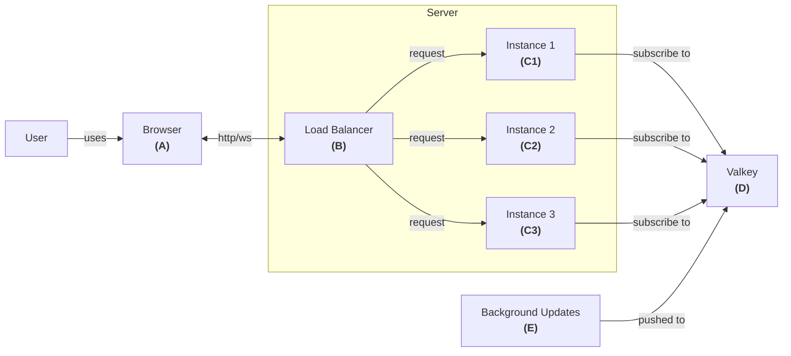

# websockets-trpc-fastify-react

Built with [Devbox](https://www.jetify.com/devbox/docs/contributor-quickstart),
[Fastify](https://fastify.dev), [tRPC](https://github.com/trpc/trpc),
[React](https://github.com/facebook/react),
[TanStack](https://github.com/tanstack), [nginx](https://github.com/nginx/nginx)

## Context :books:

This project demonstrates how to send background updates using WebSockets so
that users always receive live changes, even when the service runs on multiple
instances.

## Problem statement :pen:

[WebSockets][ws] create a two-way connection between a client and a server. In a
simple setup with a single server, messages are sent directly between them via a
[client-server][client-server] model. With multiple servers, however, a message
sent to one instance may not reach all connected clients.

For example:

- Client A connects to Server Instance 1.
- Client B connects to Server Instance 2.
- Client C connects to Server Instance 1.

If an update is sent to the wrong instance, some clients might miss it. This
project provides a solution to ensure that every user gets the update.

> **NOTE**
>
> _The architecture and technology attempts to emulate a specific environment
> where this was necessary._

## Goals :dart:

1. Run multiple service instances that support WebSocket connections.
2. Ensure all users receive background updates quickly and reliably.

## Architecture :bricks:



### Deployment :package:

See the definition in [compose.yaml](./compose.yaml).

In the "real world" the distribution looks like this:

- The client (A) is a React app bundled and delivered via a [CDN][cdn].
- The server (C) is a Node.js app running in a [Kubernetes][kubernetes] cluster.
- The domain service (E) that pushes updates to the server (C).

This project uses docker compose to emulate the environment mentioned above:

- A bundled client (A) served as static files by Nginx.
- A load balancer (B) handling traffic for 3 server instances (C).
- A script that pushes random updates (E)
- A [Valkey][valkey] instance providing background updates.

## Enabling the subscription :left_right_arrow:

The [tRPC][trpc] subscription uses Valkey to distribute updates to all connected
clients.

The client-server connection still managed by tRPC, for more details [go
here][trpc-sub]. Differently from the examples in their website, this project
uses Valkey as a backing mechanism instead of an in-memory
[EventEmitter][node-ee].

### The server setup

Check the `onUpdates` procedure in [router.ts](app/server/src/router.ts). This
function subscribes to a channel in Valkey and sends update messages to
WebSocket clients.

### The client setup

Review the component in [user-lists.tsx](app/client/src/user-lists.tsx). Here,
`useSubscription` from [tRPC][trpc] manages the WebSocket connection and updates
the UI as new data arrives.

### The load balancer setup

Check the configuration in [nginx.conf]. The upstream defined refers to service
in [compose.yaml](./compose.yaml) that is deployed with 3 replicas.

For a more realistic setup, the appropriate sticky configuration would be added
to the `upstream` section. [Here's the available options][nginx-sticky].

## See it in action :eyes:

```sh
docker compose up
```

Then open http://localhost:3001 in one or more browser windows. The app will
show which server instance sent the update.

### Development mode

```sh
bun dev
```

This is a simple playground. Both
[env.client.ts](./app/client/src/infra/env.client.ts) and
[env.server.ts](./app/server/src/infra/env.server.ts) provide default
environment values _(don't do this in production)_.

## Final note

This is a simple demonstration focusing on WebSocket communication between
distributed servers. Feel free to adapt the concepts to your specific needs, as
each project may require different approaches based on their unique
requirements! 😊

[ws]: https://en.wikipedia.org/wiki/WebSocket
[client-server]: https://en.wikipedia.org/wiki/Client%E2%80%93server_model
[cdn]: https://en.wikipedia.org/wiki/Content_delivery_network
[kubernetes]: https://en.wikipedia.org/wiki/Kubernetes
[trpc]: https://trpc.io
[trpc-sub]: https://trpc.io/docs/server/subscriptions
[valkey]: https://github.com/valkey-io/valkey
[node-ee]: https://nodejs.org/en/learn/asynchronous-work/the-nodejs-event-emitter
[nginx-sticky]: https://nginx.org/en/docs/http/ngx_http_upstream_module.html#sticky
